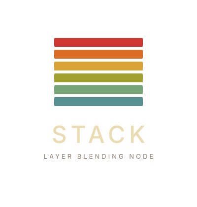
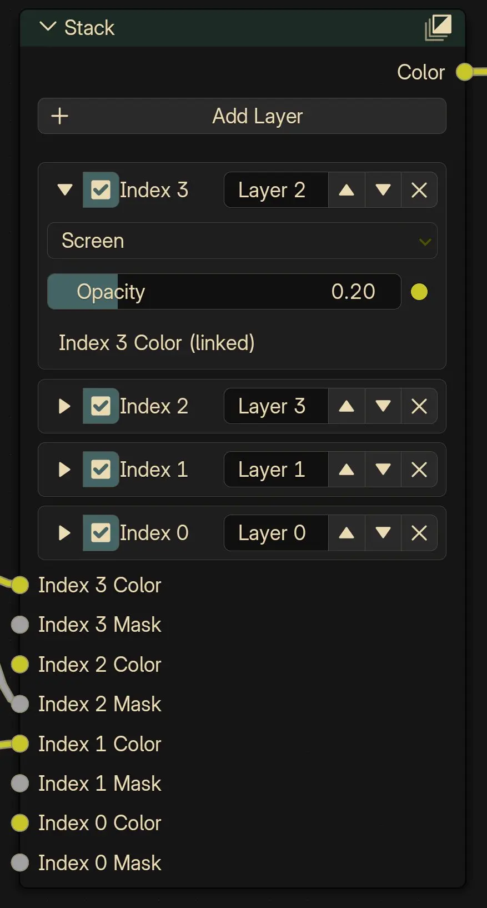

    

---

# Stack

**Layer blending node for Blender's Shader Editor.**

Stack adds a single node that lets you layer and blend textures with per-layer blend modes, opacity, and masking, similar to layer stacking in Photoshop or composite maps in other 3D tools.

---

## Features

- **Multiple layers** — add as many layers as you need
- **Blend modes** — Normal, Multiply, Add, Subtract, Screen, Overlay, Soft Light, Difference, Darken, Lighten
- **Per-layer opacity** — control the strength of each layer
- **Mask input** — plug in any texture as a per-layer mask
- **Collapsible layers** — keep the UI compact
- **Reorderable** — move layers up and down in the stack
- **Renamable** — give each layer a descriptive name
- **Non-destructive** — editing layers preserves your connections and values

    

## Install

1. Download the `stack.zip` file.
2. In Blender, go to **Edit → Preferences → Add-ons**.
3. Click **Install** and select the zip file.
4. Enable the **Stack** add-on.

## Usage

1. Open the **Shader Editor**.
2. **Add → Custom → Stack**.
3. Connect the **Color** output to your one of your material inputs material.
4. Add layers, set blend modes, adjust opacity, and connect textures.

## Requirements

- Blender 4.5.0 or later

## License

GPL-3.0-or-later
